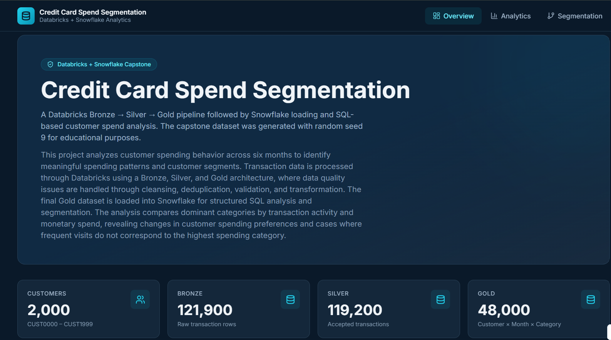
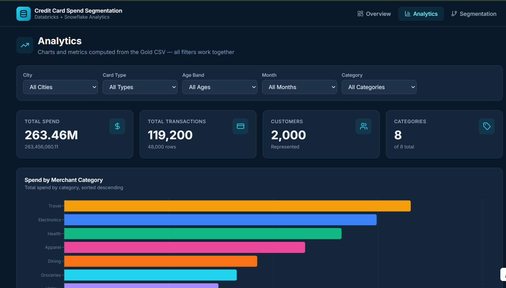
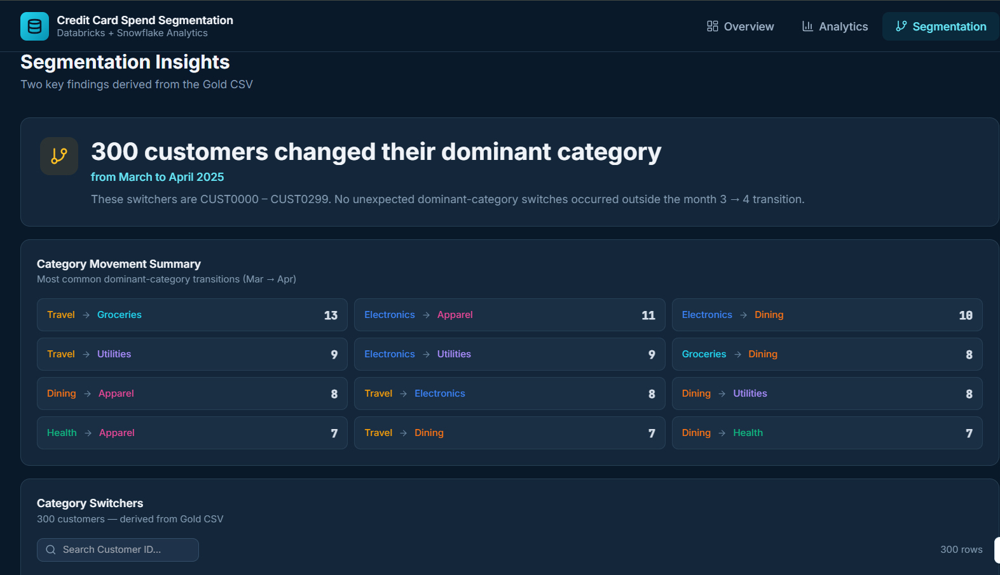

# 💳 Credit Card Spend Segmentation

🚀 **End-to-End Data Engineering & Customer Analytics Pipeline using Databricks and Snowflake**

> An end-to-end data engineering project that transforms raw credit card transaction data through a validated Bronze → Silver → Gold architecture in Databricks, loads the curated Gold dataset into Snowflake, and performs SQL-based customer spend segmentation and behavioral analysis.

---

## 📌 Problem Statement

Credit card transaction data can contain duplicate records, missing values, invalid amounts, inconsistent category names, and transactions associated with unknown customers. These data quality issues can make downstream analytics unreliable if they are not identified and handled systematically.

The challenge is to build a robust data pipeline that can ingest raw transaction data, identify and resolve data quality problems, transform the data into an analytics-ready structure, and generate meaningful customer-level spending insights.

This project addresses these challenges by implementing a modular **Bronze → Silver → Gold data engineering pipeline in Databricks**, followed by structured SQL analysis in **Snowflake**.

The final Gold dataset enables analysis of customer spending patterns, dominant merchant categories, category switching behavior, and differences between transaction-frequency-based and monetary-spend-based customer segmentation.

---

## 📸 Dashboard Preview

### 🔹 Overview



### 🔹 Analytics



### 🔹 Segmentation Insights



---

## 🎯 Project Objectives

* ✔ Build an end-to-end data engineering pipeline using Databricks
* ✔ Implement Bronze, Silver, and Gold data layers
* ✔ Identify and handle duplicates and invalid transaction records
* ✔ Handle unknown customers and data quality issues
* ✔ Normalize inconsistent merchant category names
* ✔ Validate every major transformation stage
* ✔ Produce a customer-month-category analytical dataset
* ✔ Export the Gold dataset for downstream consumption
* ✔ Load the curated dataset into Snowflake
* ✔ Perform SQL-based customer segmentation
* ✔ Identify customer category switching behavior
* ✔ Compare transaction-count and monetary-spend dominance
* ✔ Present analytical insights through an interactive dashboard

---

## 🏗️ Architecture

```text
                    RAW DATA
                       │
                       ▼
              ┌─────────────────┐
              │    Databricks   │
              │  Bronze Layer   │
              └────────┬────────┘
                       │
                       ▼
              ┌─────────────────┐
              │    Databricks   │
              │  Silver Layer   │
              └────────┬────────┘
                       │
                       ▼
              ┌─────────────────┐
              │    Databricks   │
              │    Gold Layer   │
              └────────┬────────┘
                       │
                       ▼
             GOLD_CUSTOMER_CATEGORY
                    _MONTH.csv
                       │
                       ▼
              ┌─────────────────┐
              │    Snowflake    │
              │  Staging Table  │
              └────────┬────────┘
                       │
                       ▼
              ┌─────────────────┐
              │    Snowflake    │
              │   Gold Table    │
              └────────┬────────┘
                       │
                       ▼
              SQL Analytics &
               Segmentation
                       │
                       ▼
              ┌─────────────────┐
              │    Dashboard    │
              │ Overview /      │
              │ Analytics /     │
              │ Segmentation    │
              └─────────────────┘
```

---

## 🔄 Data Pipeline

```text
Customers + Transactions
          ↓
    Bronze Ingestion
          ↓
   Data Quality Checks
          ↓
   Silver Transformation
          ↓
 Deduplication + Cleansing
          ↓
 Category Normalization
          ↓
    Customer Validation
          ↓
    Gold Transformation
          ↓
 Customer × Month × Category
          ↓
       Validation
          ↓
      CSV Export
          ↓
 Snowflake Stage & Loading
          ↓
    SQL Segmentation
          ↓
     Dashboard Insights
```

---

## 🥉 Bronze Layer

The Bronze layer preserves the raw transaction-level data after ingestion.

### Bronze Dataset

* **121,900 raw transaction rows**
* Raw transaction attributes retained
* Duplicate occurrences identified
* Unknown customers identified
* Missing transaction amounts identified
* Negative refund amounts identified
* Merchant-category spelling anomalies identified

### Bronze Data Quality Findings

| Data Quality Issue                   | Records |
| ------------------------------------ | ------: |
| Raw transaction rows                 | 121,900 |
| Duplicate occurrences                |   1,500 |
| Unknown customer records             |     400 |
| Missing transaction amounts          |     800 |
| Negative refund amounts              |     600 |
| Merchant-category spelling anomalies |     250 |
| Raw category variants                |      11 |

---

## 🥈 Silver Layer

The Silver layer cleans and standardizes the Bronze data before analytical aggregation.

### Silver Processing

* ✔ Deduplication
* ✔ Invalid amount handling
* ✔ Unknown customer rejection
* ✔ Merchant-category normalization
* ✔ Data quality validation
* ✔ Customer master validation

### Silver Results

```text
Bronze Rows
121,900
   │
   ├── Invalid Amount Rejects → 800
   │
   ├── Unknown Customer Rejects → 400
   │
   └── Accepted Transactions → 119,200
```

The final Silver dataset contains:

**119,200 accepted transactions**

and

**1,200 rejected transactions**

after the required quality checks and transformation rules.

---

## 🥇 Gold Layer

The Gold layer converts the cleaned transaction data into an analytical customer segmentation dataset.

### Gold Grain

```text
Customer × Month × Merchant Category
```

### Gold Dataset

* **48,000 rows**
* **2,000 customers**
* **6 months**
* **8 merchant categories**
* Exactly **4 categories per customer-month**

### Gold Columns

```text
customer_id
city
card_type
age_band
month
merchant_category
txns
spend
customer_month_spend
spend_share
is_dominant
```

The Gold dataset is designed for customer-level and customer-month-level spending analysis.

---

## 📊 Dataset Overview

### Customers

```text
2,000 customers
CUST0000 – CUST1999
```

### Cities

```text
Delhi
Mumbai
Chennai
Kolkata
Pune
Jaipur
Kochi
Surat
Indore
Patna
```

### Card Types

```text
Silver
Gold
Platinum
```

### Age Bands

```text
18-25
26-35
36-45
46-55
56plus
```

### Merchant Categories

```text
Groceries
Fuel
Dining
Travel
Electronics
Apparel
Utilities
Health
```

### Analysis Period

```text
January 2025 → June 2025
```

---

## 🔍 Validation

A dedicated validation stage was implemented to ensure that the pipeline produces the expected outputs.

### Validation Checks

* ✔ Customer master row count
* ✔ Customer ID range
* ✔ City distribution
* ✔ Card-type distribution
* ✔ Age-band distribution
* ✔ Bronze row count
* ✔ Duplicate detection
* ✔ Unknown customer detection
* ✔ Missing amount detection
* ✔ Refund detection
* ✔ Category anomaly detection
* ✔ Silver rejection counts
* ✔ Accepted Silver row count
* ✔ Category normalization
* ✔ Gold row count
* ✔ Four-category-per-customer-month validation
* ✔ Spend-share validation
* ✔ Dominant-category switching validation
* ✔ Spend-vs-count segmentation validation

### Final Validation Result

```text
========================================
ALL VALIDATION CHECKS PASSED
========================================
```

---

## ❄️ Snowflake Integration

The validated Gold dataset is exported from Databricks and loaded into Snowflake for structured SQL analysis.

### Snowflake Objects

```text
CCSS_DB
│
└── CREDIT_CARD_SPEND_SEGMENTATION
    │
    ├── FF_GOLD_CUSTOMER_CATEGORY_MONTH
    │
    ├── STG_GOLD_CUSTOMER_CATEGORY_MONTH
    │
    └── GOLD_CUSTOMER_CATEGORY_MONTH
```

### Loading Process

```text
Databricks Gold Dataset
          ↓
GOLD_CUSTOMER_CATEGORY_MONTH.csv
          ↓
Snowflake Stage
          ↓
COPY INTO
          ↓
Snowflake Gold Table
```

### Snowflake Validation

```text
Expected Gold Rows : 48,000
Loaded Gold Rows   : 48,000
Validation         : TRUE
```

---

## 📈 SQL Analytics

Snowflake SQL was used to perform customer-level and customer-month-level segmentation.

### Analysis Areas

* Customer-category spending analysis
* Dominant category identification
* Monthly customer segmentation
* Category switching analysis
* Transaction-frequency vs monetary-spend comparison

---

## 🧠 Key Insights

### 🔄 Customer Category Switching

**300 customers** changed their dominant spending category from **March to April 2025**.

```text
Switching Customers:

CUST0000
      ↓
   ...
      ↓
CUST0299

Total = 300 customers
```

No unexpected dominant-category switches occurred outside the March → April transition.

---

### ⚖️ Transaction Count vs Monetary Spend

The project also identifies customers where the category with the highest number of transactions differs from the category with the highest monetary spend.

**500 customers** show this disagreement consistently across all six months.

```text
CUST1500 – CUST1999

Total = 500 customers
Months checked = 6
Months with disagreement = 6
```

This demonstrates why customer segmentation based only on transaction frequency can differ from segmentation based on actual monetary value.

---

## 💰 Overall Spending Distribution

The Gold dataset represents approximately:

```text
Total Spend ≈ 263.46M
```

Spending is distributed across eight merchant categories, with **Travel, Electronics, Health, Apparel, Dining, Groceries, Utilities, and Fuel** represented in the final analytical dataset.

---

## 📊 Interactive Dashboard

The project includes a dashboard with three main sections.

### Overview

Provides:

* Project description
* Pipeline summary
* Customer count
* Bronze row count
* Silver accepted rows
* Gold row count
* Key project findings

### Analytics

Provides:

* City filtering
* Card-type filtering
* Age-band filtering
* Month filtering
* Merchant-category filtering
* Total spend
* Transaction metrics
* Customer metrics
* Category-level spending charts
* Monthly spending analysis

### Segmentation

Provides:

* Dominant-category switching analysis
* March → April customer switches
* Category movement summary
* Customer-level switcher information
* Spend-vs-count segmentation insights

---

## 🛠️ Tech Stack

### Data Engineering

* **Databricks**
* **Python**
* **Apache Spark / PySpark**
* **Pandas**

### Data Warehouse

* **Snowflake**
* **Snowflake SQL**

### Data Processing

* Bronze / Silver / Gold Architecture
* Data Cleansing
* Deduplication
* Data Validation
* Aggregation
* Feature Engineering
* Customer Segmentation

### Dashboard

* **React**
* **TypeScript**
* **Vite**
* **Tailwind CSS**
* **Recharts**

### Version Control

* **Git**
* **GitHub**

---

## 📁 Project Structure

```text
credit_card_spend_segmentation_project/
│
├── databricks/
│   ├── 00_project_config.py
│   ├── 01_setup_databricks.py
│   ├── 02_bronze_ingestion.py
│   ├── 03_silver_transformation.py
│   ├── 04_gold_transformation.py
│   ├── 05_validation.py
│   ├── 06_export_gold.py
│   └── databricks_job.json
│
├── datasets/
│   ├── customers.csv
│   ├── card_txns.csv
│   ├── GOLD_CUSTOMER_CATEGORY_MONTH.csv
│   └── dataset_validation.txt
│
├── documentation/
│   ├── DATA_DICTIONARY.md
│   ├── EXPECTED_RESULTS.md
│   ├── README.md
│   ├── RUN_ORDER.md
│   └── screenshots/
│       ├── overview.png
│       ├── analytics.png
│       └── segmentation.png
│
├── snowflake/
│   ├── 01_snowflake_objects.sql
│   ├── 02_snowflake_load.sql
│   └── 03_required_snowflake_questions.sql
│
├── validation/
│   └── static_validation_report.txt
│
├── LICENSE
└── README.md
```

---

## ▶️ Execution Order

Run the Databricks pipeline in the following order:

```text
00_project_config.py
        ↓
01_setup_databricks.py
        ↓
02_bronze_ingestion.py
        ↓
03_silver_transformation.py
        ↓
04_gold_transformation.py
        ↓
05_validation.py
        ↓
06_export_gold.py
```

After successful validation:

```text
Databricks Gold Export
        ↓
Snowflake 01_snowflake_objects.sql
        ↓
Upload GOLD_CUSTOMER_CATEGORY_MONTH.csv
        ↓
Snowflake 02_snowflake_load.sql
        ↓
Snowflake 03_required_snowflake_questions.sql
```

---

## 📌 Important Project Results

| Stage                                 |  Result |
| ------------------------------------- | ------: |
| Customers                             |   2,000 |
| Bronze Transactions                   | 121,900 |
| Silver Accepted Transactions          | 119,200 |
| Silver Rejected Records               |   1,200 |
| Gold Rows                             |  48,000 |
| Merchant Categories                   |       8 |
| Analysis Months                       |       6 |
| Category Switchers                    |     300 |
| Spend-vs-Count Disagreement Customers |     500 |
| Snowflake Loaded Rows                 |  48,000 |

---

## 🚀 Future Improvements

* Integrate real-time transaction ingestion
* Add automated Databricks job scheduling
* Implement incremental data processing
* Introduce additional customer segmentation techniques
* Add predictive customer spending models
* Extend the Snowflake analytical layer
* Add automated data-quality monitoring
* Deploy the dashboard as a production application
* Add authentication and role-based dashboard access

---

## 🌐 Live Dashboard

The project dashboard is hosted separately as a public web application.

**Live Demo:**
`[ADD_YOUR_BOLT_HOSTED_LINK_HERE](https://credit-card-spend-se-or46.bolt.host)`

> The hosted dashboard is a presentation layer for the Databricks and Snowflake project. The core data engineering pipeline and SQL implementation are maintained in this repository.

---

## 👤 Author

**Swagat Pradhan**

B.Tech — Computer Science & Engineering
Kalinga Institute of Industrial Technology (KIIT)
Bhubaneswar, Odisha

GitHub:
https://github.com/swagatpradhan2005

---

## 📄 License

This project is licensed under the **MIT License**.

See the [LICENSE](LICENSE) file for details.
